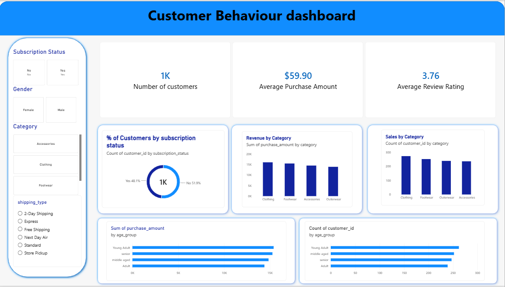

# Customer Shopping Behavior Analysis

An end-to-end data analytics project analyzing customer shopping behavior to uncover purchasing patterns, customer segments, product performance, and revenue trends — turning raw transactional data into business recommendations.



---

## Project Overview

This project follows a complete data analytics workflow to help an e-commerce business understand its customers better and make data-driven decisions:

**Data Cleaning (Python) → Business Analysis (SQL) → Visualization (Power BI) → Insights**

---

## Key Findings

*(Replace these with your real numbers — pull them straight from your SQL query results)*

- 💰 **Revenue split**: Female customers contributed **X%** of total revenue vs. **Y%** from male customers.
- 🎯 **Discount behavior**: **X%** of customers who used a discount still spent above the average purchase amount, suggesting discounts aren't purely price-driven for this segment.
- ⭐ **Top-rated products**: [Product A], [Product B], and [Product C] had the highest average review ratings (4.X+).
- 🚚 **Shipping impact**: Customers using Express shipping spent **$X more on average** than Standard shipping customers.
- 🔁 **Loyalty & subscriptions**: Subscribed customers spent **X% more** on average than non-subscribed customers.
- 👥 **Age & revenue**: The **[age group]** segment contributed the largest share of total revenue (X%).
- 🔂 **Repeat buyers**: Customers with more previous purchases were **X% more likely** to be subscribers.

---

## Business Questions Answered

1. What is the total revenue generated by male vs. female customers?
2. Which customers used discounts but still spent more than the average purchase amount?
3. Which products have the highest average review ratings?
4. How does average purchase amount differ between Standard and Express shipping?
5. Do subscribed customers spend more than non-subscribed customers?
6. Which products have the highest percentage of discounted purchases?
7. How can customers be segmented based on previous purchases?
8. What are the top-selling products within each category?
9. Are repeat buyers more likely to subscribe?
10. Which age groups contribute the most revenue?

---

## Tools & Technologies

| Tool             | Purpose                                   |
|------------------|--------------------------------------------|
| Python (Pandas)  | Data cleaning and preprocessing            |
| Jupyter Notebook | Exploratory data analysis                  |
| MySQL            | Business analysis using SQL                |
| Power BI         | Interactive dashboard and visualization    |
| GitHub           | Version control and documentation          |

---

## Project Structure

```
customer-shopping-behavior-analysis/
│
├── data/
│   └── customer_shopping_behavior.csv
│
├── notebooks/
│   └── Customer_Shopping_Behavior_Analysis.ipynb
│
├── shopping_analysis.sql
├── Customer_Behaviour_Dashboard.pbix
├── Power_BI_dashboard.png
└── README.md
```

---

## How to Reproduce

1. Clone this repo
2. Load `data/customer_shopping_behavior.csv` into MySQL and run `shopping_analysis.sql`
3. Open the notebook in `notebooks/` for the cleaning + EDA steps
4. Open `Customer_Behaviour_Dashboard.pbix` in Power BI Desktop to explore the dashboard

---

## Author

**Swapna** — [GitHub](https://github.com/SWAPNA2301)
| MySQL | Business analysis using SQL |
| Power BI | Interactive dashboard and visualization |
| GitHub | Project documentation and version control |

---

## Project Structure

```text
customer-shopping-behavior-analysis/
│
├── data/
│   └── customer_shopping_behavior.csv
│
├── notebooks/
│   └── Customer_Shopping_Behavior_Analysis.ipynb
│
├── shopping_analysis.sql
│
├── Customer_Behaviour_Dashboard.pbix
│
└── README.md
